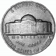
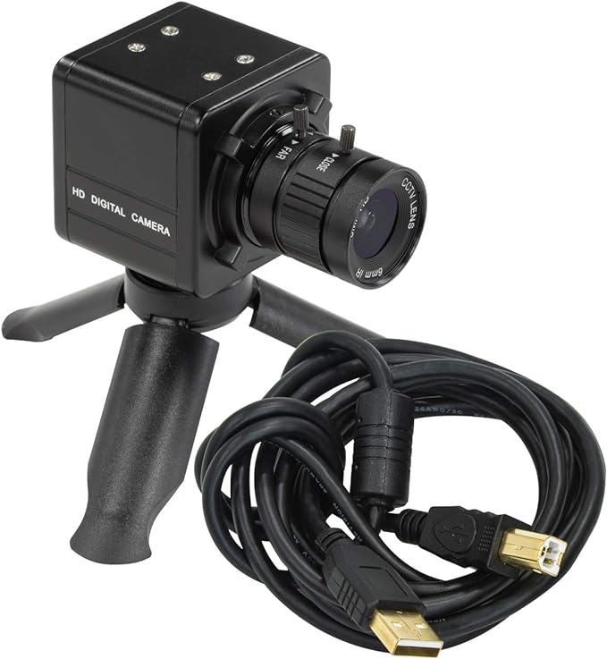

# coinCNC
Homebrew CNC system suitable for digitizing, scanning, 3D modeling coins.

Focus stacking rail, and 3D scanning trunnion..

Based on Pi HQ camera with macro lens, MakerbeamXL aluminum extrusions, and 
inexpensive Arduino based GRBL CNC controllers.

https://www.makerbeam.com/makerbeamxl/

https://www.amazon.com/dp/B08R74TYB8?psc=1&ref=ppx_yo2ov_dt_b_product_details

https://www.amazon.com/dp/B088BLQYDX?ref=ppx_yo2ov_dt_b_product_details&th=1

https://www.amazon.com/dp/B0C1CC79TX?psc=1&ref=ppx_yo2ov_dt_b_product_details

Inspired by "scAnt"
https://github.com/evo-biomech/scAnt
